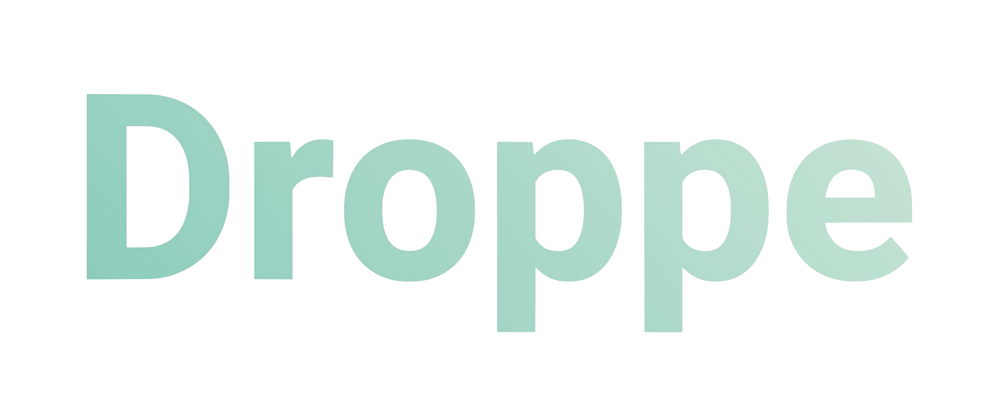

# Droppe

Buy Europe’s favourite supplies directly from manufacturers



## Packages that I installed

- axios, classnames

## Installation

App requires [Node.js](https://nodejs.org/) v14+ to run.

Install the dependencies and start the project.

```sh
cd project
npm i
npm run start
```

#

## How to use

### For access to api service:

1- please enter api service  
2- rename `.env-sample` file to `.env` in project  
3- write url address in the `.env` file and save it

```sh
REACT_APP_APP_URL=https://fakestoreapi.com
```

4- run the project

```sh
npm run start
```

5- for run test

```sh
npm run test
```

6- for production

```sh
npm run build
```

\* if you want to use docker for running the app use the below command on termial

```sh
docker compose up
```

**
Notes
** During this week I was working full time and did not have enough time to do this task. If I had enough time, I could write more tests, install and configure husky,eslint,prettier packages, and implement code splitting routers with React Lazy and Suspense.

### Thanks

Thank you for your consideration and I hope to join your team soon :)  
here are my <mehdi.kindly@gmail.com> and [website](https://www.mahdifalamarzi.info).
